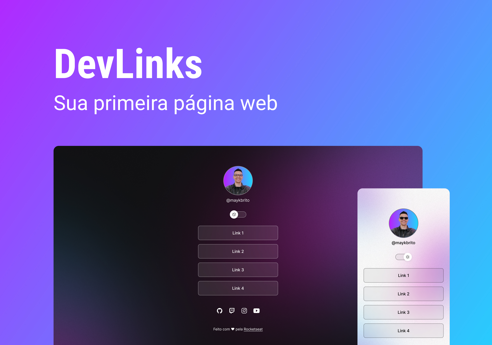

 

 
 

  <a href="#-tecnologias">Tecnologias</a>&nbsp;&nbsp;&nbsp;|&nbsp;&nbsp;&nbsp;
  <a href="#-projeto">Projeto</a>&nbsp;&nbsp;&nbsp;|&nbsp;&nbsp;&nbsp;
  <a href="#memo-licença">Licença</a>

<h1>🔖 Projeto</h1>

    O DevLinks é um agregador de links para usar como cartão de visitas online.

- [Acesse o projeto finalizado, online](https://maykbrito.github.io/devlinks)

- [Assistir aulas](https://lp.rocketseat.com.br/devlinks/inscricao?utm_source=github&utm_medium=descricao&utm_campaign=capture-devlinks&utm_term=organic&utm_content=descricao-github-mayk-brito)

---

 

## 🚀 Tecnologias

- [HTML](https://devdocs.io/html/)
- [CSS](https://devdocs.io/css/)
- [JAVASCRIPT](https://devdocs.io/javascript/)

<h2>🖍️ Design concept</h1>

- [FIGMA](https://www.figma.com/community/file/1187422022288947321)

---

 

## 🖥️ Web View

    

 

## 📱 Mobile View

    

---

 

## :memo: Licença

Esse projeto está sob a licença MIT.

---

Feito com ♥ by Rocketseat :wave: [Participe da nossa comunidade!](https://discord.gg/rocketseat)